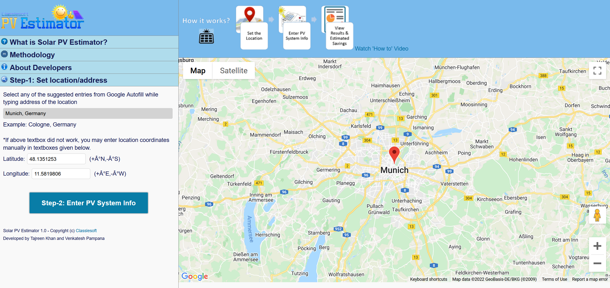

## Welcome to GitHub Pages

Solar PV Estimator is web based tool to estimate the amount of electricity that can be generated from a grid Photovoltaic system and its carbon savings at any location in the world. Its an open source project written in pure javascript and html.

### Markdown

